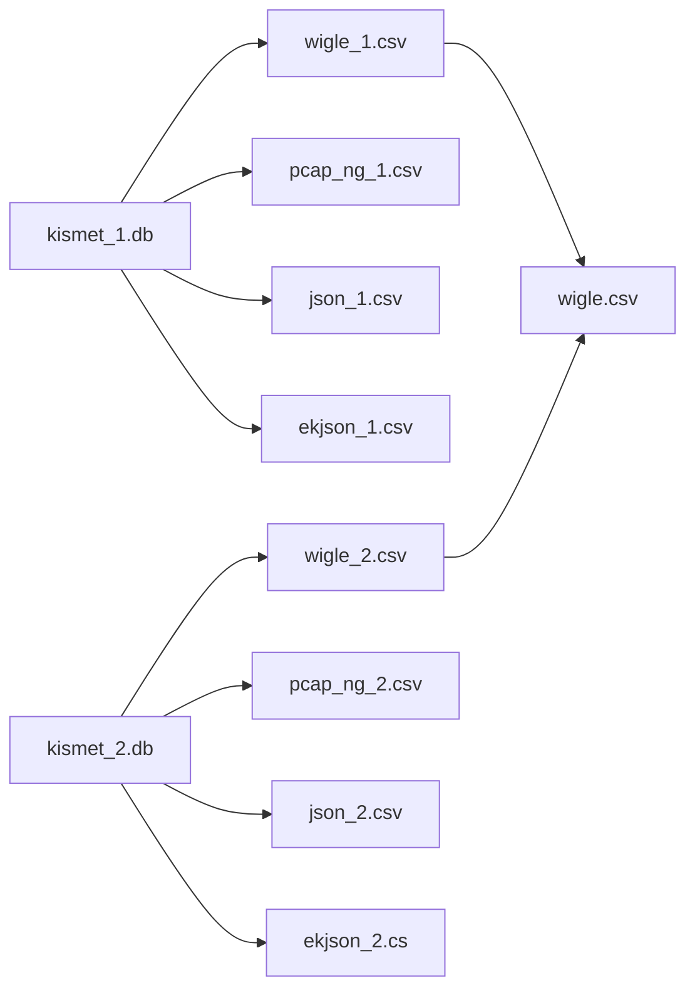

# Better Rover - Lite

Better Rover - Lite is an analysis tool meant to assist in processing large volumes of 802.11 survey data to identify potential co-traveling signals as well as likely static access points and their best guess location. It is being developed on a Raspberry Pi 4 running Raspberry Pi OS Lite (64-bit) and meant to be run on similarly powered devices.

## Intended use

BR-Lite is intended to take raw **Kismet .kismet** and **Airodump-NG .log.csv** files and iteratively parse data to identify "co-traveling signals" and provide summary data for static signals, while retaining references to raw data inputs for more specialized analytical uses. It is meant to do this in a lightweight format, requiring only a series of editable scripts, python, an HTML viewer, and the ability to reference two online databases (ArcGIS ESRI World Imagery maptiles and eventually the IEEE OUI database) for improved visualization.

## Setup

`bash setup.sh`

Creates or verifies required directory structure for input data, intermediate processed data, and output data based on the config file; installs package dependencies; updates permissions for all .sh and .py scripts permissions.

## Methodology

BRL is run by executing a master script (brl.sh) which controls the phasing of several sub-processes to iteratively convert, merge, parse, and process data that was acquired through running Kismet and Airodump. Users are prompted through the analysis iterations to generate tabular and .html interactive maps to display resulting analysis. It contains the following:

| File | Description | Output |
| ---- | ----------- | ------ |
| brl.sh | The master script. Prompts user to execute or skip each subprocess, and runs maintenance tasks (archiving data to remove it from the workflow; destruction to delete everything but source data) | ??? |
| process_source.sh | Unpacks each `data/input/kismet/*.kismet` database into WiGLE CSV, pcapNG, JSON, and ekJSON formats; renames each `data/input/airodump/*.log.csv` file based on earliest and latest timestamps per file. | Saved to `data/processed/` subdirectories, indexed by sensor and timestamps for easier downstream analysis. |
| co_traveler_merge.sh | Concatenates all unpacked WiGLE CSV files into a single merged WiGLE CSV file; concatenates all renamed airodump files into a single airodump file. | Persisted to `data/processed/merged/wigle_*.csv` and `data/processed/merged/airodump_*.csv` |
| 

## Not yet reviewed

| co_traveler_analysis.py | this is the second iterative pass of analytical proccess which aims to identify and classify signals as static or co-traveling within an optionally defined time range and output a geographic and tabular visualization of that data for users in the Outputs section. It does this by referencing the merged databases, normalizes column headers from the two input veins (airodump and kismet), and attempts to group unquie MAC addresses (which it treats as synonymous with BSSID (something that may be false though I'm honestly not sure)), with time-stamps, location data, RSSI value at the time of detection, and retains the source file tags). It then separates these into three groups (Potential Co Travler, Static, or Unknown based on the relative location of detections. Unique MAC with any detections >/= 1000m apart are Potential co-travelers, MACs with all records within 300m of each other are considered static, all others unknown (these definitions are highly biased towards experience in the Anniston region of Alabama where this script was developed - this is the first area in which I plan to try and deploy edge proccessed AI (this is a whole can of worms I'm just opening but it seems like what AI would be good for)). The script then processes this data into a .html interactive map for Potential co-travelers that references F/OS ArcGIS ESRI World Imagery map tiles, bins MACs by "max follow distance" which is the furthest pairwise distance between any two detections, drops markers that indicate locations a PCT was detected, groups repeated markers into single markers (clustering pass 1) and then uses folium's marker cluster feature for readability. KNOWN ISSUE: This two pass approach causes issues with the markers wherein markers time range displays a first seen and last seen time relevant to the marker, as opposed to the intended purpose which was the first time the MAC was detected out of the entire span of the mapped data. This means that users who click on a map marker are shown time data that is relevant more to when the signal was detected at that location (something that is already known and relatively useless from a security standpoint) instead of giving users an idea of how long a signal may have been following them. There may be value in showing both, though I'm not yet sure how best to both label that data in a way that users will understand (given the small window of information that can be presented in the marker details) or how to calculate that for the script. FUTURE DEV: Because of the nature of the output (proximity over distance), GPS paired data is the only data used in this and other processes however, there are several issues with this. 1) Survey team GPS equipment is fairly insensitive - teams are using BU353N USB connected GPS receivers and are untrained and unaware what methods if any to use to increase or calibrate the sensitivity or accuracy of these readings. Teams are also required to place these receivers in locations that may not provide the best signal quality in order to not be obtrusive or draw unwanted interactions during surveys. 2) The vast majority of the data of interest is contained in location agnostic data sets - location is merely the first filter to determine if a signal is of interest for personal security and general situational awareness. This means that a lot of data is 'left on the table' if the quality of its associated GPS data is poor. In downstream processes I try to call back to this data (particularly in the targeted_analytics.py script) but it would be more useful if it was done here. |
| static_aggregate.py | I still consider this part of the second iterative pass of the analytical process but I broke it out during development since I kept running into issues when attempting to run all these processes in one script. Workflow wise, I think it may be smarter to create a single tabular database with this classification and regressive analysis for Potential co-travelers, Statics, and Unknowns, calculations of # of detections, max distance, and perhaps a calculation for confidence level of the classification by unique MAC and then focus on creating the geographic and tabular "visualization" outputs as two separate sub-processes. This would also allow the actual analytical process to be more robust (and potentially address the GPS issue) without all the distracting reformatting needed for the visualization processes Regardless, in the current product, this process involves re-referencing the merged Wigle.csv data (as our current survey teams do not know how to enable airodump to reliably capture GPS sensor data) groups signals that are within 200m of one another (this needs to be standardized with the previous process), then attempts to create a best guess location for the signal source using a weighted average of detection coordinates weighted by the associated RSSI values (this is a mathematical process that could be improved but there are several variables to RSSI beyond the physics that may not be worth attempting to account for precisely (namely inconsistent antennae used by survey teams, inconsistent antennae placement between runs, 0 access to refined weather data during runs, and some other things I'm probably not thinking of). Considering the primary end user for this product is for the security and situational awareness of the survey teams themselves, having precise locations for static signals (the vast majority of which are part of civil infrastructre) seems like a low juice-to-squeeze ratio). The script then creates a tabular output meant to be used with the geographic output this time grouping signals by their encryption or security as opposed to follow distance. |
| static_signals_map.py | conjoined with the above process, this script merely handles the .html interactive map for static_aggregate.py. I frankly need to rework this entire second pass so I can frontload the actual analytics and then work visualization processes after the fact but considering I built this whole thing in 6 days, that this is a complete rebuild of the MK1 scripts (the development of which is included in those 6 days), and that I'm fundamentally a survey team guy with bachelors in phiolosophy and no data-analytics training or coding experience, I'm willing to accept that failure |
| flagged_signals_analysis | this is a currently broken process but would represent the third iterative pass of analysis. The intent would be to take the flagged signals from the previous pass and further refine their categorization, assigning confidence levels to each assessment and ideally doing so recursively such that as survey teams continue to operate in the field, consistently identified signals could have refined classification. This is second spot in which I think edge processed AI implementation could add value (for the same functional purpose as the first), especially if it's able to refine assessment criteria over time. I'd need to determine how I could build training sets either in the operating environment or at home so I could estimate how much time/effort would be required of survey teams to get this capability online (specifically for survey team leadership to determine their own juice:squeeze ratios (if the process takes 20-30 days and their presence in an area is 15-30, they may not be interested unless the training of the model occurs over several teams and is passed over between survey groups, but this beyond my level). |
| targeted_analytics | this process is meant to allow users to take a signal (classified based on MAC or SSID) identified in the second and third iterative passes and recursively searches for every available data point associated with that identifier across all aggregated data (including the JSON files). Consider how fluid both MAC and SSIDs can be, this needs a great deal of work and represents the second functional area where AI implementation could be useful though I'm completely unsure how I would implement this.  |\